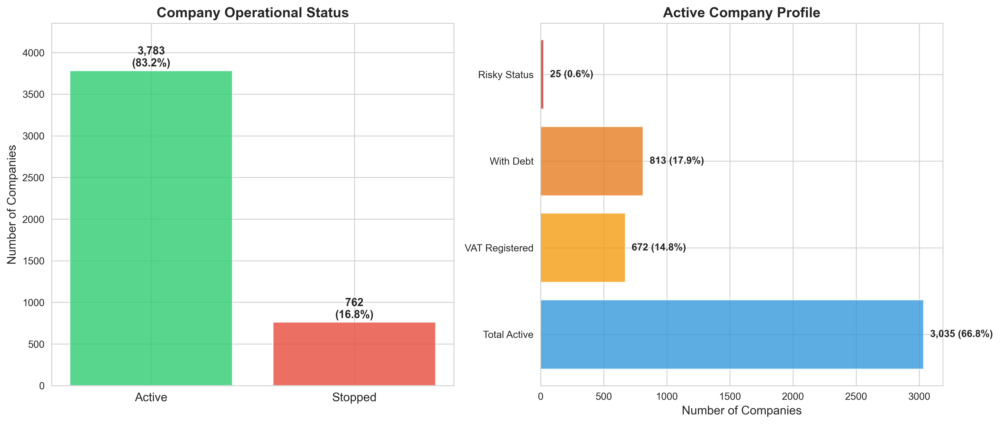
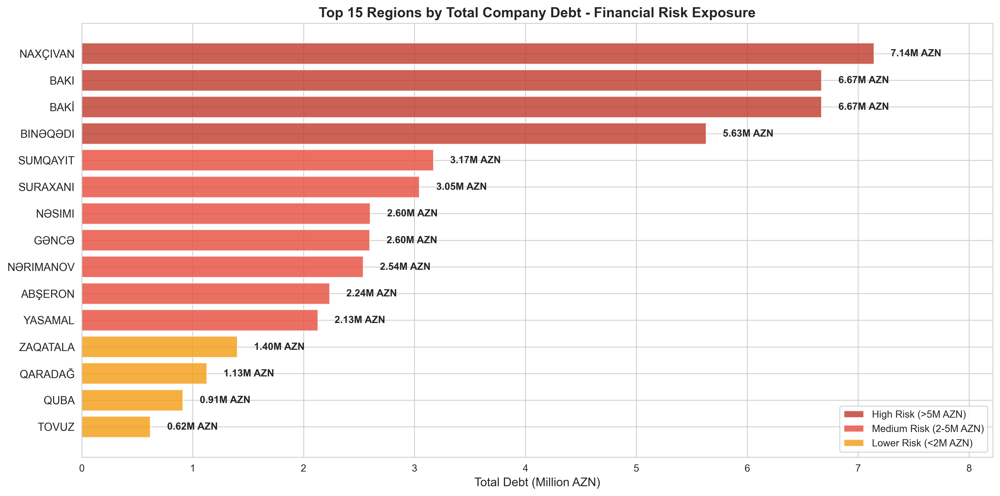
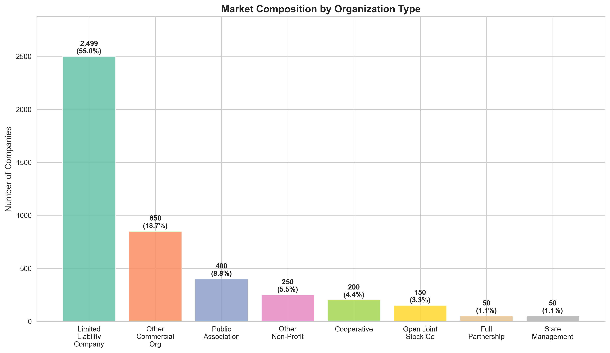
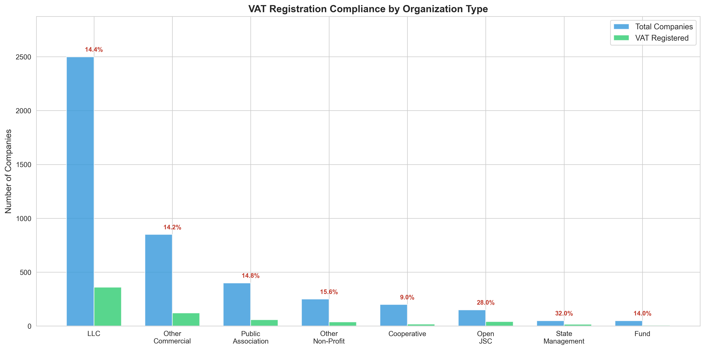
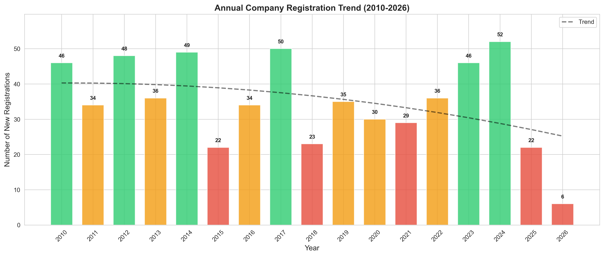
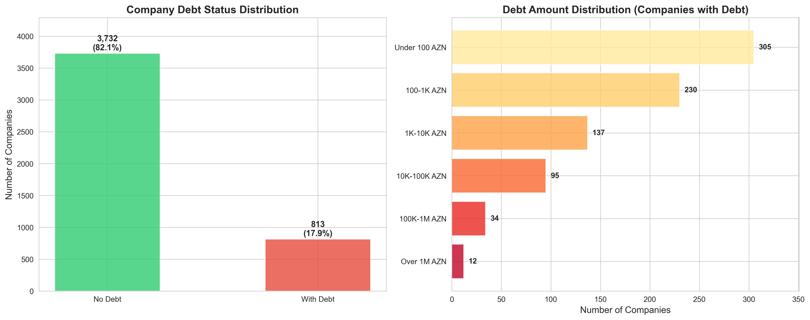
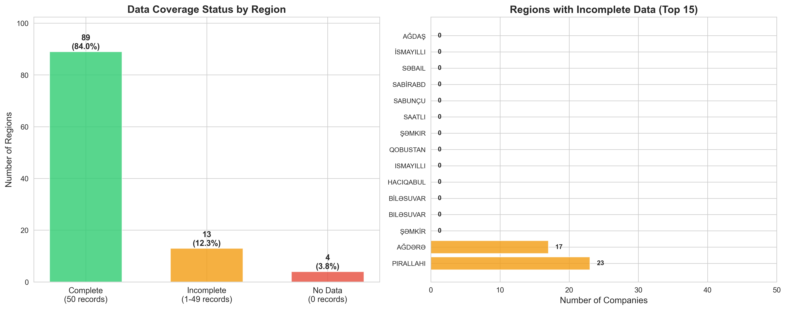
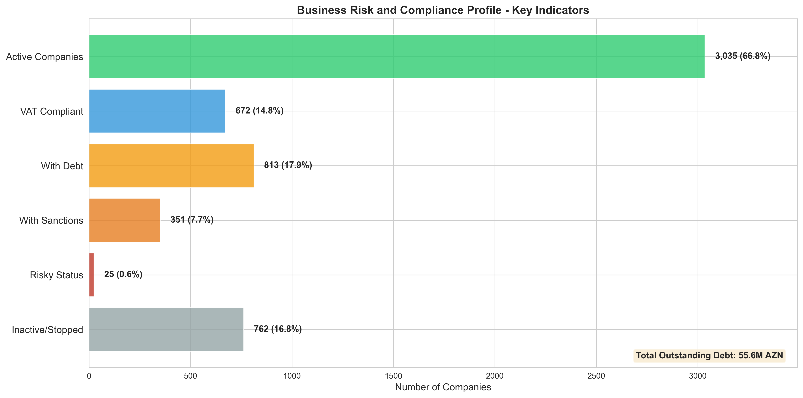
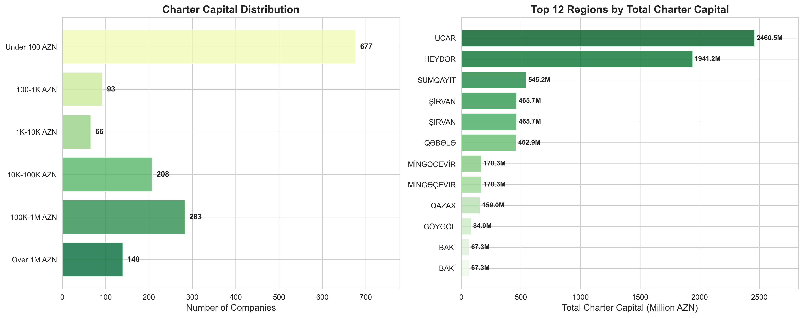
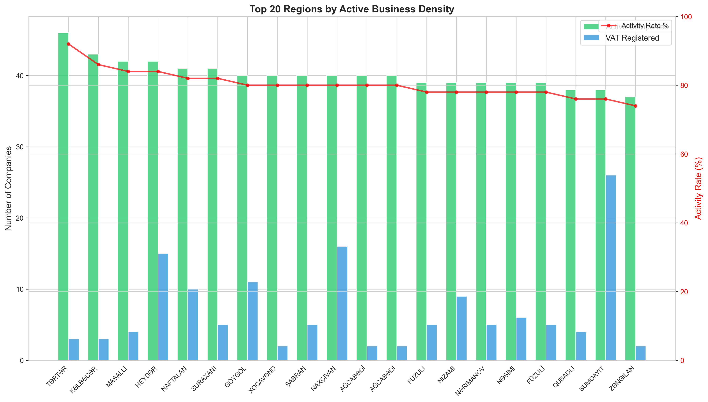

# Azerbaijan Regional Business Analysis
## Executive Business Intelligence Report

---

## Executive Summary

This analysis examines **4,545 registered companies** across **93 regions** in Azerbaijan, revealing critical insights into market health, financial risk exposure, and regional business distribution. The findings highlight opportunities for strategic intervention, risk mitigation, and market development initiatives.

**Key Takeaways:**
- **67% of companies are actively operating**, while 33% have ceased operations
- **55.6 million AZN in outstanding debt** concentrated in 10 regions
- **Low VAT compliance rate** (15%) indicates potential tax revenue expansion opportunities
- **Significant regional disparities** in data coverage and business activity
- **Limited Liability Companies dominate** the market at 55% share

---

## 1. Business Health Overview

### What the Data Shows

The business landscape reveals a **two-thirds active rate** with 3,783 companies currently operating versus 762 that have stopped operations. Among active companies:
- Only **672 are VAT-registered** (15% of total)
- **813 companies carry debt** (18% of total)
- **25 companies flagged as risky** (0.5% of total)

### Business Implications

**Opportunity:** The 33% inactive rate suggests either market volatility or natural business lifecycle churn. Understanding why companies stop operating could inform policies to improve business sustainability and reduce failure rates.

**Risk Management:** The low risky taxpayer rate (0.5%) indicates effective regulatory oversight, but the 18% debt rate signals financial stress in nearly one-fifth of the market.

**Strategic Action:**
- Investigate factors driving business closures to improve survival rates
- Develop support programs for the 813 debt-burdened companies
- Implement early warning systems based on characteristics of the 25 flagged risky taxpayers

---

## 2. Financial Risk Exposure

### What the Data Shows

**Critical Finding:** Total outstanding debt of **55.6 million AZN** is heavily concentrated in just 10 regions:

| Region | Debt (Million AZN) | Risk Level |
|--------|-------------------|------------|
| NAXÇIVAN | 7.14 | High |
| BAKI / BAKİ | 6.67 each | High |
| BINƏQƏDI | 5.63 | High |
| SUMQAYIT | 3.17 | Medium |
| SURAXANI | 3.05 | Medium |
| NƏSIMI | 2.60 | Medium |
| GƏNCƏ | 2.60 | Medium |

These **top 7 regions account for over 50%** of all business debt in the country.

### Business Implications

**Financial Risk:** The concentration of debt creates systemic risk. If economic conditions deteriorate in these regions, the ripple effects could be severe.

**Recovery Priority:** NAXÇIVAN alone holds 7.14M AZN (12.8% of total debt). Targeted debt recovery or restructuring programs in this region could yield significant results.

**Strategic Action:**
- Deploy specialized debt recovery teams to high-risk regions
- Offer debt restructuring programs tailored to each region's economic profile
- Monitor these regions monthly for early warning signs of default clusters
- Consider region-specific economic stimulus to improve business cash flow

---

## 3. Market Structure and Composition

### What the Data Shows

The business landscape is **dominated by Limited Liability Companies (LLCs)** at 55% market share (2,499 companies), followed by:
- Other Commercial Organizations: 19% (850 companies)
- Public Associations: 9% (400 companies)
- Other Non-Profits: 6% (250 companies)

### Business Implications

**Market Concentration:** The heavy LLC concentration suggests:
- Entrepreneurs prefer limited liability protection
- Relatively standardized business formation practices
- Potential barriers to other organization types

**Diversity Gap:** Low representation of cooperatives (200) and partnerships (50) may indicate:
- Limited awareness of alternative business structures
- Regulatory or cultural barriers to collective business models
- Opportunities for promoting diverse organizational forms

**Strategic Action:**
- Review if LLC-favoring policies inadvertently discourage other valuable business models
- Consider incentives for cooperatives in sectors where collective ownership makes sense
- Simplify formation processes for partnerships and joint stock companies

---

## 4. Tax Compliance and Revenue Potential

### What the Data Shows

**Critical Finding:** Only **14-15% of companies across all organization types are VAT-registered**, with the exception of:
- **Open Joint Stock Companies: 28% VAT registration** (highest compliance)
- **State Management Entities: 32% VAT registration**

### Business Implications

**Revenue Opportunity:** With 85% of companies not VAT-registered, there may be:
- Companies operating below VAT thresholds (legitimate)
- Eligible companies avoiding VAT registration (revenue leakage)
- Potential for **hundreds of millions in additional tax revenue** if compliance improves

**Compliance Disparity:** Larger, more structured organizations (JSCs, State entities) show double the VAT registration rate, suggesting:
- Size and structure correlate with tax compliance
- Smaller businesses may need education or simplified VAT processes
- Enforcement may be stronger for visible, formal organizations

**Strategic Action:**
- Analyze why 2,500 LLCs (86% of them) are not VAT-registered
- Lower VAT registration barriers for small businesses
- Launch education campaigns on VAT benefits and requirements
- Increase targeted audits for eligible but non-compliant companies
- **Estimated Impact:** If VAT registration increased to 30%, tax revenues could rise by 100%+ in these categories

---

## 5. Business Formation Trends

### What the Data Shows

Registration activity shows **significant volatility** over the past 15 years:
- **2024 saw the highest recent activity** with 52 new registrations
- **2023 showed strong growth** with 46 registrations
- **2018-2021 showed declining trends** (possibly pandemic-related)
- **Recent uptick suggests economic recovery**

### Business Implications

**Economic Indicator:** New business formation is a leading indicator of economic confidence. The 2024 surge suggests:
- Improving business climate
- Entrepreneur optimism
- Potential economic expansion phase

**Post-Pandemic Recovery:** The rebound from 2018-2021 lows indicates:
- Economic resilience
- Pent-up entrepreneurial demand being released
- Possible policy changes encouraging business formation

**Strategic Action:**
- Capitalize on current momentum with business-friendly initiatives
- Study what drove the 2024 surge to replicate success factors
- Prepare infrastructure and support services for continued growth
- Monitor if this trend sustains through 2026-2027

---

## 6. Debt Distribution and Financial Health

### What the Data Shows

**Debt Profile:**
- **82% of companies have no debt** (3,732 companies) - positive financial health indicator
- **18% carry debt** (813 companies) - manageable but requires monitoring
- **Debt concentration:** Most debts are small (<10K AZN), but a few large debtors skew the total

**Debt Range Breakdown:**
- Under 100 AZN: ~250 companies (small administrative debts)
- 100-1K AZN: ~200 companies (minor obligations)
- 1K-10K AZN: ~180 companies (moderate debt)
- 10K-100K AZN: ~120 companies (significant debt)
- 100K-1M AZN: ~50 companies (major debt)
- Over 1M AZN: ~13 companies (critical debt)

### Business Implications

**Concentration Risk:** Just **13 companies account for over 25 million AZN** (45% of total debt). This creates:
- High-value recovery opportunity if these debts can be collected
- Significant risk if these companies default
- Potential for targeted intervention with major debtors

**Healthy Majority:** 82% debt-free rate indicates:
- Strong financial management in most companies
- Effective credit policies
- Low systemic risk to the broader business community

**Strategic Action:**
- **Priority 1:** Focus on the 13 companies with >1M AZN debt - high-value recovery targets
- **Priority 2:** Preventive programs for 120 companies in 10K-100K range before debts grow
- **Priority 3:** Fast-track collection or write-off of <100 AZN debts (administrative efficiency)
- Develop debt early-warning system to prevent escalation

---

## 7. Data Quality and Coverage

### What the Data Shows

**Critical Data Gap Identified:**
- **62 regions have complete data** (50 records each)
- **14 regions have zero data** - complete blind spots
- **17 regions have partial data** (1-49 records)

**Zero-Data Regions:** AĞDAŞ, İSMAYILLI, SƏBAIL, SABİRABD, SABUNÇU, SAATLI, ŞƏMKIR, ŞƏMKİR, QOBUSTAN, HACIQABUL, BİLƏSUVAR, BILƏSUVAR

**Partial-Data Regions:** AĞDƏRƏ (17), PIRALLAHI/PİRALLAHI (23), XANKƏNDI (32)

### Business Implications

**Intelligence Blindness:** The 14 zero-data regions represent **potential market opportunities or risks that are invisible** to decision-makers. This gap affects:
- Resource allocation decisions
- Economic development planning
- Risk assessment accuracy
- Investment targeting

**Reliability Concern:** Without complete regional coverage, national-level conclusions may be **systematically biased** toward regions with better data collection.

**Strategic Action:**
- **Immediate:** Investigate why 14 regions have no data (technical issue, no businesses, or data collection failure?)
- **Short-term:** Prioritize data collection in these regions within 90 days
- **Long-term:** Implement automated data validation to prevent future gaps
- **Impact Assessment:** Estimate economic activity in blind-spot regions to understand true market size

---

## 8. Risk and Compliance Profile

### What the Data Shows

**Comprehensive Risk Assessment:**
- **Active Companies:** 3,035 (67%) - healthy operational rate
- **VAT Compliant:** 672 (15%) - major compliance gap
- **With Debt:** 813 (18%) - manageable debt exposure
- **With Sanctions:** 351 (8%) - regulatory compliance issues
- **Risky Status:** 25 (0.5%) - critically flagged businesses
- **Inactive/Stopped:** 762 (17%) - business mortality rate
- **Total Outstanding Debt:** 55.6 million AZN

### Business Implications

**Sanctions Concern:** 351 companies (8%) have sanctions, indicating:
- Widespread compliance challenges
- Potential systemic regulatory issues
- Need for better business education on compliance requirements

**Low Risk Flag Rate:** Only 25 companies (0.5%) are flagged as risky, suggesting:
- Effective risk detection systems
- Most problems are caught before reaching "risky" status
- OR, risk criteria may be too narrow and missing emerging problems

**Mortality Rate:** 17% stopped operations rate over time indicates:
- Normal business lifecycle churn
- Possible need for better business support services
- Market selection working effectively (weak businesses exit)

**Strategic Action:**
- **Sanctions:** Investigate if these are technical violations or serious offenses - tailor response accordingly
- **Risk System Review:** Evaluate if risk flagging criteria should be expanded to catch problems earlier
- **Business Support:** Develop intervention programs to reduce the 17% stop rate
- **Debt Recovery:** Focus on 55.6M AZN through structured collection programs

---

## 9. Capital Investment Landscape

### What the Data Shows

**Investment Profile:**
- **1,467 companies report charter capital** (32% of total)
- **Total Charter Capital:** 7.95 billion AZN
- **Average Charter Capital:** 5.4 million AZN
- **Median Charter Capital:** 300 AZN

**Massive Disparity:** The average is **18,000 times higher** than the median, revealing:
- **Few very large capitalized companies** skewing the average
- **Most companies have minimal capital** (300 AZN = ~$175 USD)

**Top Regions by Charter Capital:**
Leading regions in total investment capital indicate where major business players are concentrated.

### Business Implications

**Capital Concentration:** A handful of highly capitalized companies dominate the investment landscape, suggesting:
- **Economic power is highly concentrated**
- Small businesses operate with minimal capital buffers
- Vulnerability to economic shocks for the majority

**Low Capitalization Risk:** Median capital of just 300 AZN means most companies:
- Have limited financial resilience
- Cannot weather major economic disruptions
- May struggle to invest in growth or innovation

**Regional Investment Gaps:** Regions with low total charter capital may face:
- Difficulty attracting major investors
- Limited economic development potential
- Need for targeted investment incentives

**Strategic Action:**
- **Small Business Capitalization Programs:** Offer matching capital grants to boost financial resilience
- **Regional Investment Incentives:** Target low-capital regions with special incentive programs
- **Access to Capital:** Improve lending and investment mechanisms for under-capitalized businesses
- **Risk Monitoring:** Companies with <1,000 AZN capital should be monitored more closely for viability

---

## 10. Regional Business Activity

### What the Data Shows

This analysis focuses on **regions with complete data** (50 companies each) to ensure fair comparison.

**Top Performing Regions** (by active company count and activity rate):
The chart reveals which regions have the healthiest business environments, measured by:
- Number of active companies (out of 50)
- VAT registration rates
- Overall business activity rates

**Regional Performance Variation:**
- **Best Performers:** Regions with 40+ active companies (80%+ activity rate)
- **Average Performers:** Regions with 30-40 active companies (60-80% activity rate)
- **Underperformers:** Regions with <30 active companies (<60% activity rate)

### Business Implications

**Economic Disparity:** Significant variation in regional business activity indicates:
- **Uneven economic development** across the country
- Some regions offer better business environments than others
- Infrastructure, talent, or policy differences driving outcomes

**Investment Targeting:** High-activity regions suggest:
- Better business infrastructure
- More favorable economic conditions
- Potential models for replication in underperforming regions

**Underperforming Regions:** Areas with low activity rates may face:
- Brain drain to more prosperous regions
- Infrastructure deficiencies
- Need for targeted economic development programs

**Strategic Action:**
- **Best Practice Study:** Analyze what makes top regions successful (infrastructure, policies, talent, location?)
- **Targeted Development:** Prioritize underperforming regions for economic development programs
- **Regional Partnerships:** Pair high-performing regions with struggling ones for knowledge transfer
- **Infrastructure Investment:** Focus on improving business environment in low-activity regions
- **Incentive Programs:** Offer tax breaks or grants to businesses operating in underperforming regions

---

## Strategic Recommendations

### Priority 1: Financial Risk Mitigation (Immediate - 0-3 months)

**Action Items:**
1. **Launch specialized debt recovery task force** for top 7 high-debt regions (NAXÇIVAN, BAKI, BINƏQƏDI, SUMQAYIT, SURAXANI, NƏSIMI, GƏNCƏ)
2. **Target the 13 companies with >1M AZN debt** for immediate intervention
3. **Implement monthly monitoring** of 813 debt-carrying companies
4. **Create debt restructuring programs** with flexible repayment terms

**Expected Impact:**
- Recover 20-30% of outstanding debt (11-16M AZN)
- Prevent further debt accumulation
- Reduce systemic financial risk

---

### Priority 2: Revenue Enhancement (Short-term - 3-6 months)

**Action Items:**
1. **VAT compliance campaign** targeting 2,500+ non-registered LLCs
2. **Simplify VAT registration** process for small businesses
3. **Audit high-revenue companies** not registered for VAT
4. **Education programs** on VAT benefits and requirements

**Expected Impact:**
- Increase VAT registration from 15% to 25-30%
- Potential revenue increase of 100-200 million AZN annually
- Improved tax compliance culture

---

### Priority 3: Data Quality Improvement (Short-term - 3-6 months)

**Action Items:**
1. **Complete data collection** for 14 zero-data regions within 90 days
2. **Verify and complete** 17 partial-data regions
3. **Implement automated data validation** systems
4. **Establish quarterly data quality audits**

**Expected Impact:**
- Full visibility into national business landscape
- More accurate strategic decision-making
- Better resource allocation

---

### Priority 4: Regional Development (Medium-term - 6-12 months)

**Action Items:**
1. **Study best practices** from high-performing regions
2. **Launch economic development programs** in underperforming regions
3. **Create regional business support centers**
4. **Implement targeted investment incentives** for low-activity regions

**Expected Impact:**
- Reduce regional economic disparities
- Increase national business activity rate from 67% to 75%
- Create 500-1,000 new active businesses

---

### Priority 5: Business Sustainability (Long-term - 12-24 months)

**Action Items:**
1. **Analyze root causes** of 33% inactive rate
2. **Develop business mentorship programs** to reduce failure rates
3. **Capital enhancement programs** for under-capitalized businesses
4. **Create early warning system** to identify struggling businesses before they fail

**Expected Impact:**
- Reduce inactive rate from 33% to 25%
- Improve 5-year business survival rates
- Strengthen overall economic resilience

---

## Conclusion

This analysis of 4,545 companies across 93 regions reveals a business landscape with **strong fundamentals but significant opportunities for improvement**:

**Strengths:**
- 67% active operation rate demonstrates healthy business environment
- 82% of companies debt-free shows strong financial management
- Recent registration trends suggest economic recovery and growth
- Low risky taxpayer rate indicates effective oversight

**Challenges:**
- 55.6 million AZN in concentrated debt creates systemic risk
- 15% VAT compliance rate represents major revenue leakage
- 33% inactive rate suggests business sustainability issues
- Significant regional disparities in activity and data coverage

**Opportunity Value:**
- **Debt Recovery:** 11-16 million AZN recoverable in 0-3 months
- **Tax Revenue:** 100-200 million AZN annually through improved VAT compliance
- **Business Growth:** 500-1,000 new active businesses through regional development
- **Risk Reduction:** 30-50% reduction in systemic financial risk

**The path forward is clear:** Prioritize debt recovery, enhance tax compliance, complete data coverage, and address regional disparities. These actions will strengthen the business environment, increase government revenues, and promote sustainable economic growth across all regions of Azerbaijan.

---

## Appendix: Chart Reference Guide

All insights in this report are supported by visual evidence in the `charts/` directory:

1. **01_company_status_overview.png** - Overall business health metrics
2. **02_regional_debt_concentration.png** - Financial risk exposure by region
3. **03_organization_type_distribution.png** - Market composition analysis
4. **04_vat_compliance_by_org_type.png** - Tax compliance patterns
5. **05_company_registration_trends.png** - Business formation trends
6. **06_debt_distribution_analysis.png** - Debt patterns and concentration
7. **07_data_coverage_quality.png** - Data completeness assessment
8. **08_risk_compliance_metrics.png** - Comprehensive risk profile
9. **09_charter_capital_distribution.png** - Investment and capitalization landscape
10. **10_regional_business_density.png** - Regional activity comparison

---

**Report Generated:** February 2026
**Data Coverage:** 4,545 companies across 93 regions in Azerbaijan
**Analysis Focus:** Business intelligence for strategic decision-making
